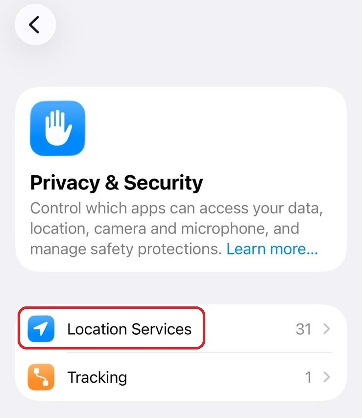
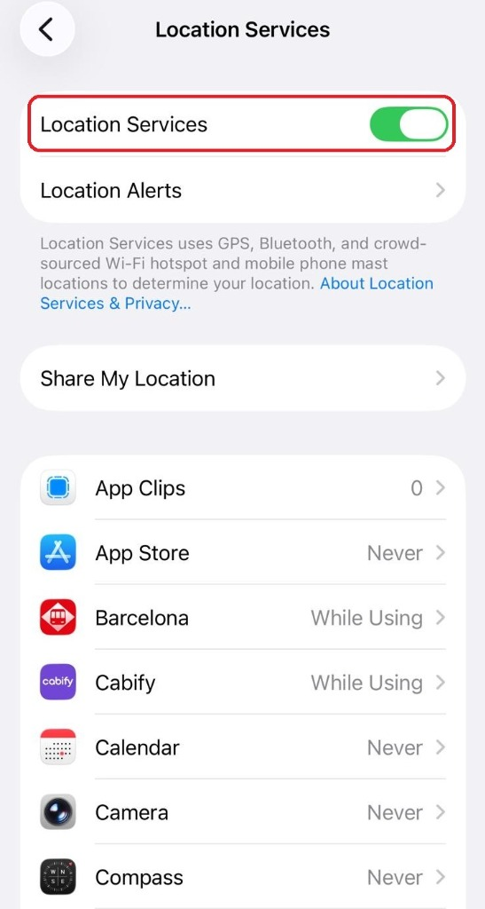
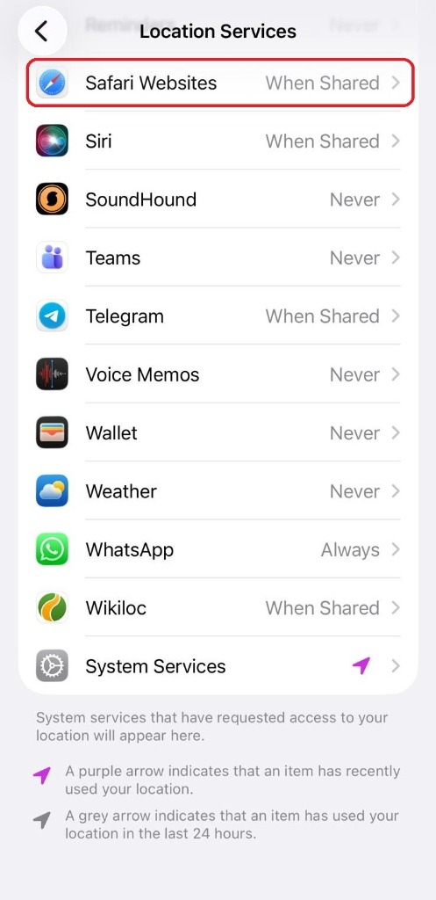
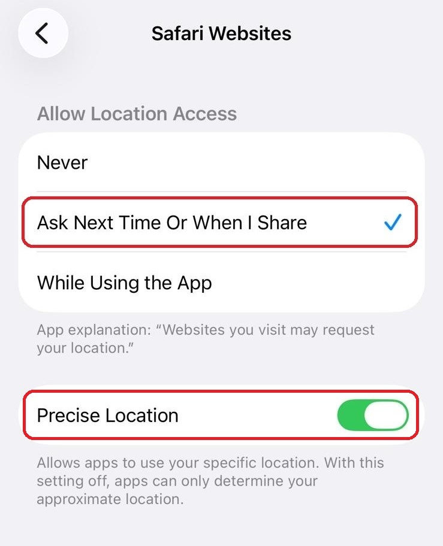
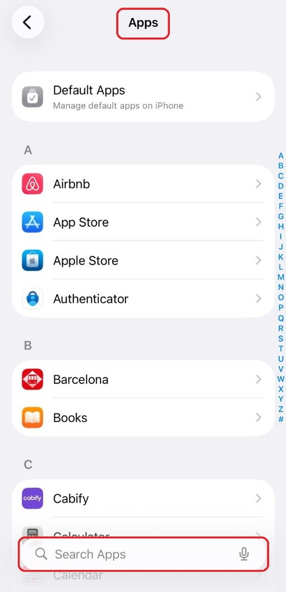
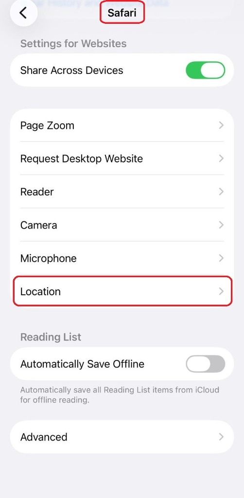
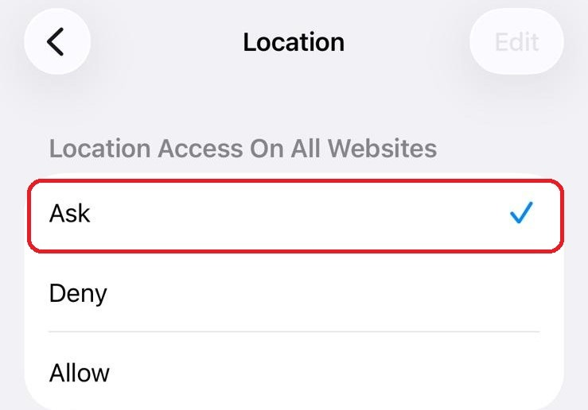

# 📍 Geolocation Troubleshooting

This guide is for troubleshooting specific location issues. For general setup, see the [User Guide](USER_GUIDE.md).

## Problem: "Location Access Denied"

If you see an error saying location was denied or blocked, this is most commonly caused by system or app settings that have location disabled. If you've used the app before, it could also be that your browser saved a "No" answer from a previous visit.

### 🍏 Fix for iOS (iPhone/iPad)

**iOS Safari has two layers of permissions:**

1. **System Level**:
   - Go to **Settings** → **Privacy & Security** → **Location Services**.
   

   
   - Ensure it is **ON**.
   

   - In the same menu, scroll down to **Safari Websites**.
   

   
   - Set to **"While Using the App"** (or "Ask Next Time") and check **Precise Location**.
   

   
   - *If set to "Never", Safari will auto-block all sites.*

2. **App Level**:
   - Go to **Settings** and find **Safari** (or search in Apps).
   

   
   - Scroll to **Settings for Websites** and tap **Location**.
   

   
   - Ensure it is set to **"Ask"** or "Allow".
   

**To clear a specific block:**
1. Go to **Settings** → **Safari** → **Advanced** → **Website Data**.
2. Search for `nestfinder` or `github`.
3. Swipe left to **Delete**.
4. Refresh the page and tap "Allow" when asked.

### 🤖 Fix for Android (Chrome)

1. Open **Chrome**.
2. Tap **Menu (⋮)** → **Settings** → **Site Settings**.
3. Tap **Location**.
4. Check if `nestfinder` is in the "Blocked" list.
5. Tap the site and select **Allow**.

**To clear cache:**
1. Tap the lock icon 🔒 in the address bar.
2. Tap **Permissions** → **Reset permissions**.

---

## Problem: "Location Unavailable" or Timeout

1. **Check GPS**: Ensure your phone's GPS/Location toggle is actually on.
2. **Go Outside**: Sometimes GPS signals are weak indoors.
3. **Refresh**: Reload the page and try again.

---

## Still Not Working?

You can still use the app!

- **Manual Mode**: When reporting a point, choose "**Select on Map**" to manually drop a pin without needing GPS.

---

## 🗺️ NestFinder Anywhere (Offline Mode)

NestFinder now includes enhanced offline capabilities:

### What Works Offline
- **Map Tiles**: Up to 2000 tiles are cached for offline viewing.
- **Point Data**: Recently viewed points are cached for 24 hours.
- **Cached Actions**: Submissions and confirmations are queued when offline.

### Lite Mode
In Settings, toggle **"Lite Mode"** to improve performance on slower devices:
- Disables animations
- Reduces visual effects
- Optimizes battery usage

### Reconnecting
When you regain connectivity:
- Queued actions are automatically synced.
- You'll see a notification confirming the sync.

