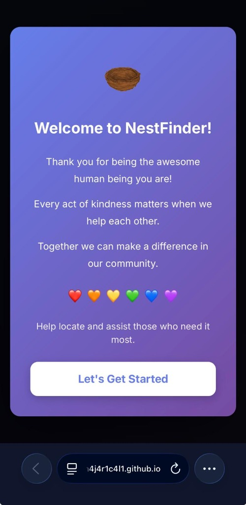

# 📱 NestFinder User Guide

Welcome to **NestFinder**! This guide will help you get started with the app on your mobile device or computer.

## 🚀 Getting Started

NestFinder is a web app (PWA) that you can install directly on your phone without going to an App Store.

### Step 1: Open the App
Visit: [https://m4j4r1c4l1.github.io/nestfinder/](https://m4j4r1c4l1.github.io/nestfinder/)

  
  

### Step 2: Install to Home Screen

#### 🍏 iOS (iPhone/iPad)
1. Tap the **Share** button (box with arrow) or **Menu** (three dots).
   

     
     
   

2. Scroll down and tap **"Add to Home Screen"**.
    
3. Tap **Add**.
4. Success!
    

#### 🤖 Android (Chrome/Brave)
*(Screenshots shown using Brave browser)*
1. Tap the **Menu** button (three dots).
    
2. Tap **"Add to Home screen"** (or "Install app").
    
3. Tap **Add** in the dialog.
   

     
     
   

4. Success!
    

---

## 📍 Enable Location Services

To find resources near you and use route navigation, the app needs your location.

> [!IMPORTANT]
> **Privacy First**: We only use your location to show nearby points and calculate routes.

### iOS (iPhone)
1. Go to **Settings** → **Privacy & Security**. Select **Location Services**.
   

2. Make sure **Location Services** is **ON**.
   

3. Scroll down to **Safari Websites**.
   

4. Select **"Ask Next Time or When I Share"** (or "While Using the App") and ensure **Precise Location** is ON.
   

### Android
1. Go to **Settings** → **Location**, ensure it's **ON**, and check your browser permissions.
   

     
     
   

2. If you see the **Enable Location** screen, tap the button:
    
3. When the browser asks, select your preference and tap **Allow**:
    

### Troubleshooting
If you see a purple banner saying "Enable Your Location", tap the **Enable Location** button.

If it still doesn't work, clear your browser cache and try again. See full [Geolocation Troubleshooting](GEOLOCATION.md).

---

## 📖 Daily Usage

### Map View
The main screen is the map.

- **My Location**: Tap the 📍 button (bottom right) to center on you.
- **Filter**: Tap the funnel icon to show only specific points (e.g., confirmed only).
   

### Adding a Point
Help others by reporting resources!
1. Tap **Report** in the bottom menu.
2. Choose a location:
   - **Current Location**: Use where you are now.
      
   - **Select on Map**: Tap a spot on the map.
      
   - **Address**: Type the address manually.
      
3. Add details (tags, notes).
4. Tap **Submit**.
   
### Verifying Points
Tap any marker on the map to see details. You help the community by verifying reports!
- **Confirm Active**: Tap this if you find the nest/resource.
- **Report Inactive**: Tap this if it's gone or empty.
 

### Planning a Route
Find the best walking path to visit multiple places.
1. Move the map to show the area you want to visit.
2. Tap **Route** 🚶.
3. Tap **Calculate Route** and follow the numbered path!
   

     
     
   

### Exporting Data
You can download visible points for other uses.
1. Tap **Download** ⬇️.
2. Select **JSON** or **CSV**.
    

### Viewing Messages
Check the **Inbox** for updates on points you've reported or subscribed to.
- **Badge**, **Inbox Panel**, and **Reminders**:
   

     
     
     
   

### Settings & Language
Tap **Settings** ⚙️ to:
- Change Language (EN, ES, FR, PT, etc.)
- Turn notifications on/off

- Turn notifications on/off
 
