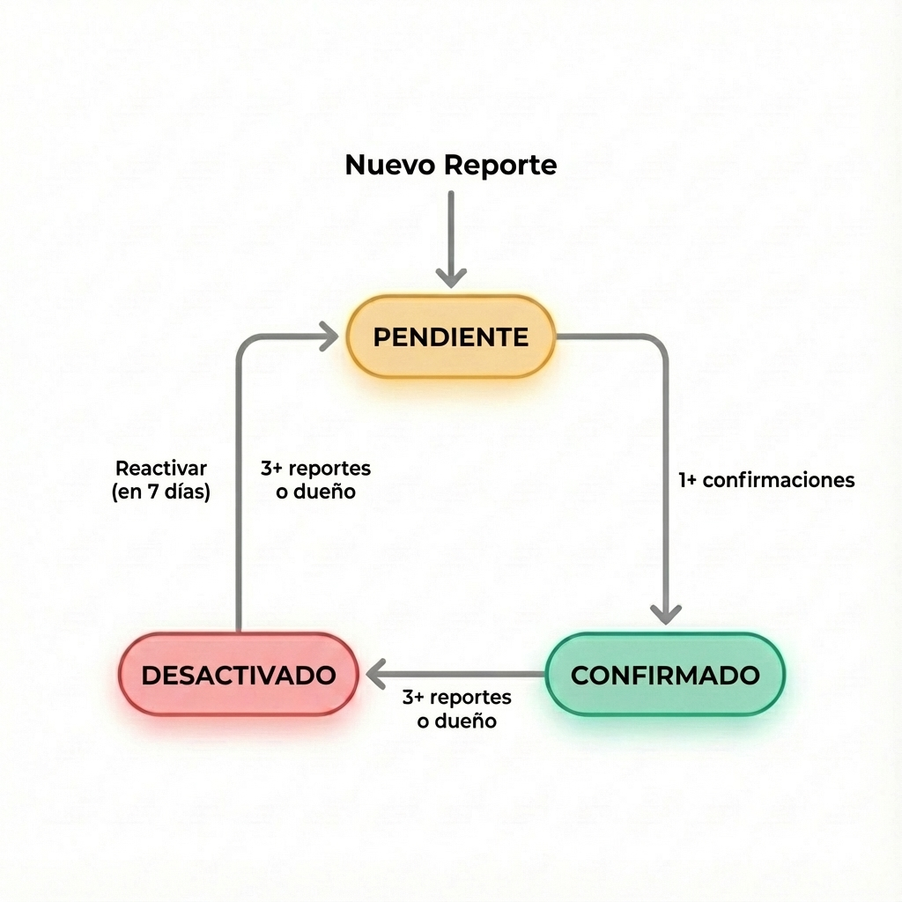

# 📱 Guía de Usuario de NestFinder

¡Bienvenido a **NestFinder**! Esta guía te ayudará a comenzar a usar la app en tu dispositivo móvil u ordenador.

---

**Contenido**
- [🚀 Primeros Pasos](#-primeros-pasos)
- [📍 Activar Servicios de Ubicación](#-activar-servicios-de-ubicación)
- [📖 Uso Diario](#-uso-diario)
  - [Vista del Mapa](#vista-del-mapa)
  - [Añadir un Punto](#añadir-un-punto)
  - [Verificar Puntos](#verificar-puntos)
  - [Planificar una Ruta](#planificar-una-ruta)
  - [Exportar Datos](#exportar-datos)
  - [Ver Mensajes](#ver-mensajes)
  - [Configuración e Idioma](#configuración-e-idioma)

---

## 🚀 Primeros Pasos

NestFinder es una aplicación web (PWA) que puedes usar directamente en tu teléfono sin pasar por la App Store ni instalar nada.

### Paso 1: Abre la App
Visita: [https://m4j4r1c4l1.github.io/nestfinder/](https://m4j4r1c4l1.github.io/nestfinder/)

### Paso 2: Instalar en Pantalla de Inicio (Opcional)

> [!TIP]
> Instalar en tu pantalla de inicio es **opcional**. ¡La app funciona perfectamente en cualquier navegador! Instalarla solo facilita el acceso y ofrece una experiencia más similar a una app nativa.

#### 🍏 iOS (iPhone/iPad)
1. Toca el botón **Compartir** (cuadro con flecha) o **Menú** (tres puntos).

  
  

2. Desplázate hacia abajo y toca **"Añadir a pantalla de inicio"**.

3. Toca **Añadir**.

4. ¡Listo!

#### 🤖 Android (Chrome/Brave)
*(Capturas de pantalla usando el navegador Brave)*

1. Toca el botón **Menú** (tres puntos).

2. Toca **"Añadir a pantalla de inicio"** (o "Instalar app").

3. Toca **Añadir** en el diálogo.

  
  

4. ¡Listo!

---

## 📍 Activar Servicios de Ubicación

Para encontrar recursos cerca de ti y usar la navegación de rutas, la app necesita tu ubicación.

> [!IMPORTANT]
> **Privacidad Primero**: Solo usamos tu ubicación para mostrar puntos cercanos y calcular rutas.

### iOS (iPhone)

1. Ve a **Ajustes** → **Privacidad y Seguridad**. Selecciona **Localización**.

2. Asegúrate de que **Localización** esté **ACTIVADA**.

3. Desplázate hasta **Sitios web de Safari**.

4. Selecciona **"Preguntar la próxima vez"** (o "Mientras se usa la app") y asegúrate de que **Ubicación exacta** esté ACTIVADA.

### Android

1. Ve a **Ajustes** → **Ubicación**, asegúrate de que esté **ACTIVADA**, y revisa los permisos del navegador.

  
  

2. Si ves la pantalla **Activar Ubicación**, toca el botón:

3. Cuando el navegador pregunte, selecciona tu preferencia y toca **Permitir**:

### Solución de Problemas
Si ves un banner morado diciendo "Activa tu Ubicación", toca el botón **Activar Ubicación**.

Si ves este mensaje del sistema de iOS, toca "**Permitir mientras se usa la app**":

Si aún no funciona, limpia la caché del navegador e inténtalo de nuevo. Consulta la guía completa de [Solución de Problemas de Geolocalización](GEOLOCATION.md).

---

## 📖 Uso Diario

### Vista del Mapa
La pantalla principal es el mapa.

- **Mi Ubicación**: Toca el botón 📍 (abajo a la derecha) para centrarte en tu posición.
- **Filtrar**: Toca el icono de la lupa 🔍 para mostrar solo puntos específicos (ej., solo confirmados).

  
  

### Añadir un Punto
¡Ayuda a otros reportando recursos!

1. Toca **Reportar** en el menú inferior.
2. Elige una ubicación:
   - **Ubicación Actual**: Usa donde estás ahora.
   - **Seleccionar en Mapa**: Toca un punto en el mapa.
   - **Dirección**: Escribe la dirección manualmente.

  
  
  

3. Añade detalles (etiquetas, notas).
4. Toca **Enviar**.
   
### Verificar Puntos
¡Toca cualquier marcador en el mapa para ver detalles. Ayudas a la comunidad verificando reportes!
- **Confirmar Activo**: Toca esto si encuentras el nido/recurso.
- **Reportar Inactivo**: Toca esto si ya no está o está vacío.

#### Flujo de Estados de Puntos
Los puntos pasan por diferentes estados según las acciones de la comunidad:

### Planificar una Ruta
Encuentra el mejor camino a pie para visitar múltiples lugares.
1. Mueve el mapa para mostrar el área que quieres visitar.
2. Toca **Ruta** 🚶.
3. Toca **Calcular Ruta** ¡y sigue el camino numerado!

  
  

### Exportar Datos
Puedes descargar los puntos visibles para otros usos.
1. Toca **Descargar** ⬇️.
2. Selecciona **JSON**, **CSV**, **GPX** o **KML**.

### Ver Mensajes
Revisa el **Buzón** para actualizaciones sobre puntos que has reportado o a los que te has suscrito.

  
  

Los mensajes no leídos se mostrarán con una insignia:

### Configuración e Idioma
Toca **Configuración** ⚙️ para:
- Cambiar Idioma (EN, ES, FR, PT, etc.)
- Cambiar estilo de notificaciones (alertas emergentes vs. buzón silencioso)

